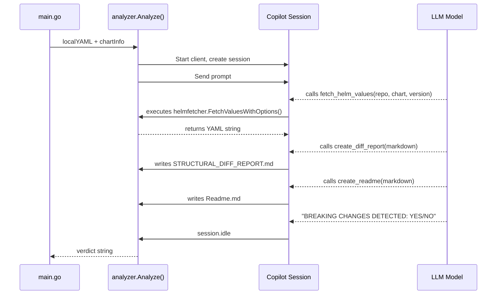

# How the Copilot SDK Is Used in `copilot-support-agent`

> This document summarises how the GitHub Copilot Go SDK (`github.com/github/copilot-sdk/go v0.2.0`) is integrated into this project to power AI-driven Helm chart analysis.

---

## What This Project Does

`copilot-support-agent` is a CLI tool that detects **breaking changes** in Helm chart dependencies. It compares upstream `values.yaml` (latest published version) against local overrides and produces two reports — a structural diff and a readme of all overridable options.

The **Copilot SDK is the AI backbone**: the tool feeds chart data to a Copilot-powered LLM session, gives it tools to fetch extra data and write files, then collects a one-line verdict.

---

## Where the SDK Lives

All SDK usage is contained in a single file:

**`internal/analyzer/analyzer.go`** — the `Analyze()` function is the only entry point.

```
main.go  ──calls──▶  analyzer.Analyze(ctx, localYAML, chartInfo, opts)
                              │
                              ├─ Creates Copilot client & session
                              ├─ Registers 3 tools
                              ├─ Sends a prompt with chart data
                              ├─ Waits for the model to finish
                              └─ Returns the model's verdict string
```

---

## SDK Integration Steps (in order)

### 1. Start the Client

```go
client := copilot.NewClient(&copilot.ClientOptions{LogLevel: "error"})
client.Start(ctx)
defer client.Stop()
```

This boots the Copilot CLI server process in the background. The project uses `"error"` log level to keep output clean.

### 2. Define Three Tools

The model is given three tools it can call during analysis:

| Tool | What It Does | Writes To |
|---|---|---|
| `fetch_helm_values` | Fetches `values.yaml` from any HTTP/OCI Helm repo for a given chart + version | *(returns data to model)* |
| `create_diff_report` | Writes the structural diff analysis | `STRUCTURAL_DIFF_REPORT.md` |
| `create_readme` | Writes upstream options documentation | `Readme.md` |

**Why tools instead of direct code?** The model decides *when* and *how* to use them — it can fetch additional chart versions if needed, and it controls the content of both output files.

All three tools have `SkipPermission = true` so they execute without user prompts.

### 3. Create a Session with a System Prompt

```go
session, _ := client.CreateSession(ctx, &copilot.SessionConfig{
    SystemMessage: &copilot.SystemMessageConfig{Content: systemPrompt},
    OnPermissionRequest: copilot.PermissionHandler.ApproveAll,
    Tools: []copilot.Tool{fetchTool, readmeTool, diffReportTool},
})
defer session.Disconnect()
```

The system prompt (defined as `const systemPrompt` in `analyzer.go`) instructs the model to:
- Compare upstream vs local `values.yaml` for structural diffs
- Flag breaking changes (type changes, removed keys, restructured blocks)
- Flag missing overrides (new upstream keys in blocks the user already overrides)
- Write reports via the `create_diff_report` and `create_readme` tools
- Respond with **only** `"BREAKING CHANGES DETECTED: YES"` or `"NO"`

### 4. Send the Prompt and Wait

The prompt bundles the Chart.yaml info and local `values.yaml`, then tells the model to use `fetch_helm_values` for upstream data.

```go
session.Send(ctx, copilot.MessageOptions{Prompt: prompt})
<-done  // blocks until session.idle event
```

Events are collected via `session.On()`:
- `assistant.message` → accumulates the final verdict text
- `error` → captures failures
- `session.idle` → signals completion

### 5. Return the Verdict

The accumulated `response.String()` (either `"BREAKING CHANGES DETECTED: YES"` or `"NO"`) is returned to `main.go`, which prints it.

By this point the model has already written both `.md` files to disk via its tool calls.

---

## Flow Diagram



---

## Credential Passthrough

CLI flags `--registry-username` / `--registry-password` flow through to the `fetch_helm_values` tool so the model can access private Helm registries:

```
CLI flags → AnalyzeOptions → tool handler closure → helmfetcher.FetchOptions
```

The tool handler checks params first (model-provided), then falls back to CLI-provided credentials.

---

## Key Design Decisions

1. **Single session, single prompt** — the entire analysis happens in one model turn with tool calls; no multi-turn conversation.
2. **Model controls output** — the model writes both report files, giving it flexibility to adapt the format and content.
3. **Verdict is forced minimal** — the system prompt constrains the direct response to a single line, keeping programmatic parsing trivial.
4. **Tool permissions skipped** — all tools are safe (read-only fetch + local file writes), so `SkipPermission = true` avoids interactive prompts.
